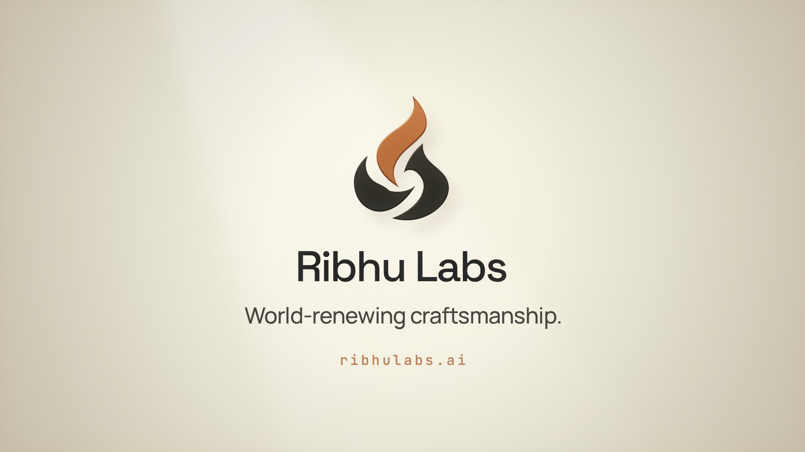

# Ribhu Labs — "One Cup, Made Four"

A 39-second brand film for [Ribhu Labs](https://ribhulabs.ai). Every frame and every sound is generated from code.

[](film.mp4)

**▶ [`film.mp4`](film.mp4)**: 1920×1080, 30 fps, 8-sample motion blur and anti-aliasing, H.264 + AAC. [`film-share.mp4`](film-share.mp4) is a lighter copy for messaging apps.
**▶ [`index.html`](index.html)**: the same film playing live in the browser (serve the folder over HTTP).

"Ribhu" is an old word for a skilled maker, and one of the oldest tales is about three brothers who made one cup into four. The film retells that tale as Ribhu Labs' way of working:

| Time | Scene |
|------|-------|
| 0–6 s | **The tale.** A hand-hammered copper cup in a dark workshop; three sparks, three makers. |
| 6–9 s | **01 Understand.** The cup is scanned into points and contours: *See the work as it is.* |
| 9–12 s | **02 Make.** A slender robotic hand works the cup, and one becomes four. |
| 12–18 s | **Four kinds of work:** automation, operations, robotics & vision, agronomy. |
| 18–21 s | **One system.** Four lights become one: *Intelligence. Put to work.* |
| 21–30 s | **03 Renew.** In slow motion, the robot's fingertips hand a seed of light to a human hand. |
| 30–39 s | **The mark.** Three flames assemble into the logo as darkness turns to ivory. |

## How it's made

- **Pure functions of time.** Canvas2D plus three.js, rendered in headless Chromium. Each scene is a pure function of time, which makes it scrubbable and lets the renderer sample sub-frames.
- **Offline render** (`tools/render.mjs`). Each output frame averages 8 sub-frames across a 180° shutter, each with a sub-pixel camera jitter, so motion blur and anti-aliasing come together.
- **Score** (`tools/synth.py`). Synthesised in numpy/scipy: a modal singing-bowl model for the cup's voice, felt piano, FM mallets, workshop percussion and sound design. The master lands at −14 LUFS and −1.3 dBTP, cued to the picture.
- **The logo.** Used verbatim from `public/brand/ribhu-mark.svg`. The 3D version is an extrusion of those exact paths.
- **The hands.** The robotic hand is an original procedural rig and an illustrative concept, not a product. The human hand is the MIT-licensed WebXR generic hand (`assets/`, license included), posed, subdivided and skin-shaded.
- **Timing.** Scenes are authored on a 30 s story timeline. The engine maps it to the 39 s film (`REEL.TIMEMAP`), so Renew plays in slow motion; the score runs at 80 BPM.

[`STORYBOARD.md`](STORYBOARD.md) has the full shot list, hand-off contracts, style guide and cue sheet.

```bash
npm install && npm run vendor          # Playwright + three.js bundle
pip install numpy scipy pillow imageio-ffmpeg
python3 tools/synth.py                 # → audio/film.wav
node tools/render.mjs                  # → film.mp4 (~30 min on 4 CPU cores)
node tools/preview.mjs sheet --from 7.5 --to 10   # contact sheet of a range
```

Fonts: Space Grotesk, Manrope and JetBrains Mono (SIL Open Font License; the license texts are in `fonts/`).
