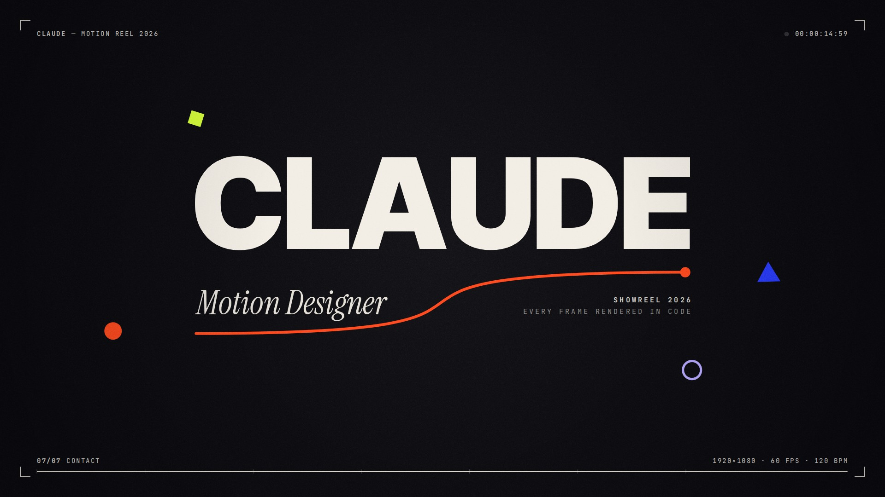

# Claude — Motion Reel 2026

A 15-second motion design showreel in which every frame, and every sound, is
generated from code. Nothing is keyframed in a timeline and nothing is sampled.

[](showreel.mp4)

**▶ [`showreel.mp4`](showreel.mp4)**: 1920×1080, 60 fps, H.264 + AAC, with
8-sample 180° motion blur.
**▶ [`index.html`](index.html)**: the same reel playing live in the browser,
with scrubbing, chapter markers and frame stepping.

## The reel

"It starts with a curve." Seven chapters, each one a fundamental of motion
design, cut on a 120 BPM grid and handed off with match cuts:

| # | Time | Chapter | What it shows |
|---|------|---------|---------------|
| 01 | 0–2 s | Easing & Timing | A live graph editor. Bezier handles spring a linear curve into `cubic-bezier(.83,0,.17,1)`, a dot rides it, and an onion-skin spacing chart shows the ease. The dot then floods the frame. |
| 02 | 2–4 s | Kinetic Type | TIMING / *is* / EVERYTHING: mask reveals, a serif italic with a signal tittle, a variable-font weight wave, an echo stack and a strip exit. |
| 03 | 4–6 s | Shape & Rhythm | A Swiss 5×3 grid of fifteen beat-synced geometric loops. They pop in with the plucks, collapse into one circle and flood to ink. |
| 04 | 6–8 s | Particles & Flow | A curl-noise particle burst swarms into FLOW, then beads magnetically onto a lattice. |
| 05 | 8–10 s | 3D & Dimension | The lattice extrudes into a flat-shaded iso city whose skyline punches ripples on every kick, then glitches out. |
| 06 | 10–12 s | Range | Eight vignettes in eight 8th notes: liquid, op art, split-flap, wireframe, type field, speed lines, datamosh, CRT power-off. |
| 07 | 12–15 s | Contact | The drop. The name lands, and the chapter-one curve returns as its underline. |

The chapters are designed to hand off seamlessly, and the exact contracts
between them are written up in [`STORYBOARD.md`](STORYBOARD.md).

## How it works

- **Every frame is a pure function of time.** Each scene's `draw(ctx, t)`
  keeps no state between calls, and anything that needs simulation (the
  particles) is pre-simulated deterministically at load. That makes the reel
  scrubbable. It also lets the renderer sample sub-frames for real motion
  blur and split frames across parallel browser pages.
  `tools/preview.mjs purity` checks this property.
- **Canvas 2D only.** The 3D is a software projection with flat shading and
  a painter's sort. The metaballs are marching squares. The glitches are
  re-blitted buffer slices.
- **Offline render.** `tools/render.mjs` drives headless Chromium through
  Playwright. It averages 8 sub-frames across a 180° shutter for each output
  frame, adds grain and a vignette, then encodes BT.709 H.264 with ffmpeg.
- **The soundtrack is synthesised.** `tools/synth.py` (numpy/scipy) builds
  the kick, bass, pads, FM plucks, risers, impacts, convolution reverbs and a
  BS.1770-metered master chain. It lands at −14 LUFS and −1.25 dBTP, with
  every cue within a few milliseconds of the picture and a true digital
  silence before the drop.

```
index.html            live player (canvas + scrubber)
src/engine.js         timing, easing, beat grid, noise, colour, geometry, text, 3D, HUD, post
src/runtime.js        player loop, render-mode API, motion-blur accumulation
src/scenes/*.js       one file per chapter
tools/render.mjs      full render → showreel.mp4
tools/preview.mjs     contact sheets, frame strips, stills, benchmarks, purity check
tools/synth.py        soundtrack → audio/showreel.wav
STORYBOARD.md         the director's brief: timings, hand-off contracts, style guide, cue sheet
```

## Running it

```bash
npm install                    # Playwright (uses an installed Chromium)
pip install numpy scipy pillow imageio-ffmpeg

python3 tools/synth.py         # → audio/showreel.wav (bit-identical every run)
node tools/render.mjs          # → showreel.mp4   (--mb 8 --workers 3 --crf 14 by default)
node tools/preview.mjs sheet --from 6 --to 8   # contact sheet of a range
```

To watch it live, serve the folder over HTTP (`npx serve .`) and open
`index.html`. Keys: space plays and pauses, ←/→ step one frame (hold shift for
one second), 1–7 jump to a chapter, H toggles the HUD and M toggles sound.

Fonts: Inter Tight, Instrument Serif and JetBrains Mono (SIL Open Font
License; the license texts are in `fonts/`).
